<!--
마크다운으로 작성된 파일입니다. 
정확한 외관은 https://github.com/701b/Movier에서 확인할 수 있습니다.
-->
Movier
======

Movier은 앱 사용자 간에 영화에 대한 평가를 공유할 수 있는 앱입니다.

## 목차
1. 앱 개요
2. 앱 특징
3. back-end 서버와의 통신
4. 사용한 API
5. 테스트 환경

### 1. 앱 개요

앱을 다운받고 최초로 실행하면 회원가입을 담당하는 Activity가 켜집니다.

 

아이디와 비밀번호를 입력하고 성별을 선택한 뒤, 가입 버튼을 누르면 로그인 Activity로 넘어갑니다.

회원가입때 사용한 아이디와 비밀번호를 사용하여 로그인하면 메인 Activity로 넘어갈 수 있습니다.  
로그인한 계정 정보는 로컬에 저장되며, 이후 앱 실행 때 저장한 정보로 자동 로그인합니다.

'영화 검색'이라고 쓰여진 부분에 영화 제목을 작성하여 검색할 수 있습니다.  
이 외에 오른쪽 상단의 사람 모양 아이콘을 누르면 NavigationView를 통해 사용자 계정에 대해 확인할 수 있습니다.

사람 모양 아이콘을 터치하면 오른쪽에서 navigationView가 나옵니다.

navigation view를 닫고, 영화 제목을 쓰고 검색 버튼을 터치하면 2열로 영화들이 나옵니다.  
터치하여 해당 영화에 대한 자세한 정보와 다른 사용자들의 리뷰가 있는 Activity로 넘어갈 수 있습니다.

영화에 대한 자세한 정보와 다른 사용자들의 리뷰를 이 Activity에서 확인할 수 있습니다.

여기서 평점 별로 남여 비율을 나타낸 그래프를 확인할 수 있고,  
다른 사람들의 리뷰도 확인할 수 있습니다.  
리뷰가 마음에 든다면 좋아요 버튼을 눌러줄 수도 있습니다.  
더보기 버튼을 터치하여 더 많은 사람들의 리뷰도 확인할 수 있습니다.  
아니면 리뷰 작성 버튼을 터치하여 직접 작성할 수도 있습니다.

### 2. 앱 특징

앱 특징으로는 다음과 같이 있습니다.
1. Landscape 지원
2. 사용자와의 상호작용
3. 자동 로그인

#### (1) Landscape 지원
>
>Movier 앱은 어느 화면에서나 가로 화면을 지원합니다.  
>
>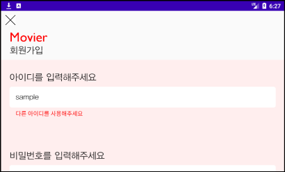  
>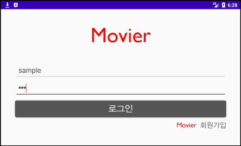  
>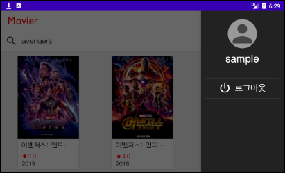  
>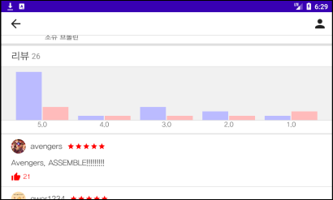  
>
>세로 화면에서 가로 화면으로 앱 사용 도중 전환해도 정보 손실이 일어나지 않습니다.  
>또한, 영화를 검색하는 Activity에서는 가로 화면으로 전환하면서 넓어지는 가로 길이에 맞추어  
>영화가 나열되는 배치가 2열에서 3열로 바뀌도록 했습니다.  
>
>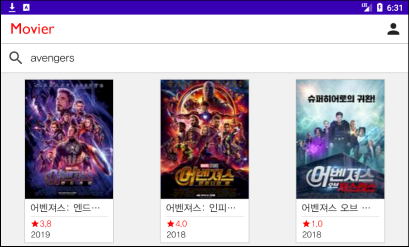  

#### (2) 사용자와의 상호작용
>
>Movier 앱은 사용자와 상호작용할 때 즉각적이고 직관적인 피드백을 할 수 있도록 디자인되어 있습니다.  
>
>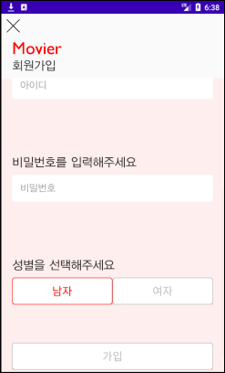
>
>회원가입 페이지에서 처음에는 가입 버튼이 회색으로 되어 있는 것을 확인할 수 있습니다.  
>이는 가입을 하기 위해 조건이 충족되지 않았다는 뜻입니다.  
>이 때 버튼을 터치하면 어떤 조건이 필요한지 즉각적으로 피드백을 해줍니다.
>
>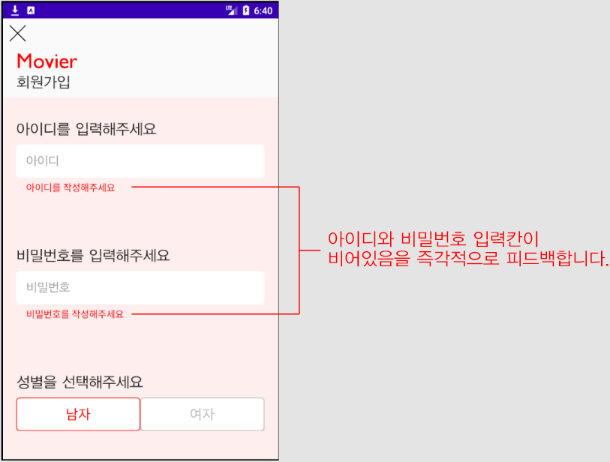
>
>아이디와 비밀번호 입력칸이 비어있다고 사용자에게 알려줍니다.  
>이제 아이디를 입력해보겠습니다. 아이디 입력칸은 문자가 입력될 때마다 데이터베이스와 통신하여  
>중복된 아이디인지 검사합니다.
>
>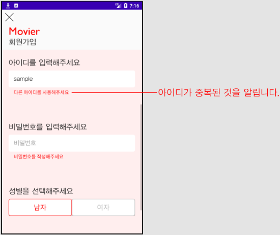
>
>이 피드백을 보고 사용자는 아이디가 중복되어서 다른 아이디를 사용해야 한다는 것을 바로 알 수 있습니다.  
>아이디를 입력하고 나서 비밀번호 입력칸이 선택되면 비밀번호 입력칸의 위치에 맞게 자동으로 스크롤됩니다.  
> 
>
>
>비밀번호 입력칸이 선택되니 입력하기 편하도록 스크롤되는 것을 확인할 수 있습니다.  
>
>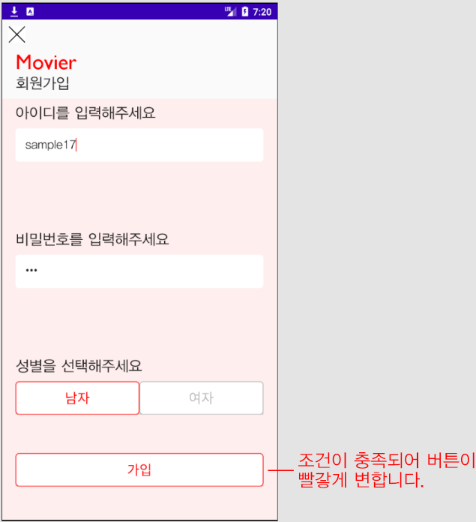
>
>아이디와 비밀번호를 조건에 맞게 입력하고 나면 가입 버튼이 빨갛게 변한 것을 확인할 수 있습니다.  
>이제 버튼을 터치하면 가입이 완료됩니다.
>
>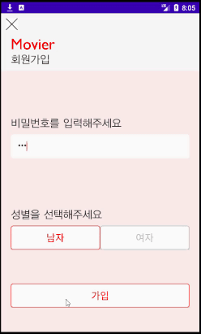
>
>가입 버튼을 누르니 progressDialog가 띄워지는 것을 볼 수 있습니다.  
>만약 데이터베이스와 통신하면서 지연되는 시간에 아무 표시도 하지 않는다면  
>사용자는 버튼을 터치하지 않았다고 생각하거나 앱이 렉먹었다고 생각할 것입니다.  
>하지만 progressDialog를 띄움으로써 앱이 통신 중임을 알려줄 수 있습니다.
>
>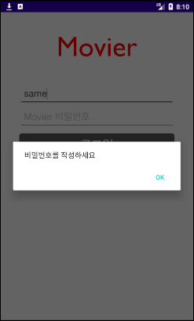
>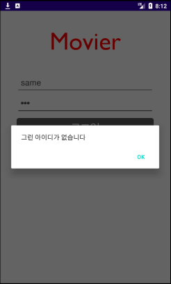
>
>로그인 페이지에서도 아이디나 비밀번호를 작성하지 않았거나,  
>아이디나 비밀번호가 틀리면 즉각적으로 피드백해줍니다.
>  
>이제 영화 검색 페이지로 가보겠습니다.
>
>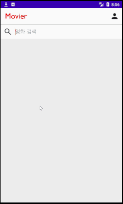
>
>영화 검색 입력칸에 영화 제목을 쓰고 검색 버튼을 터치하면 검색된 영화들을 가리지 않도록  
>키보드가 자동으로 내려갑니다.
>
>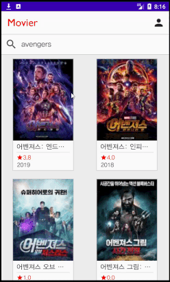
>
>이제 영화를 터치하면 데이터베이스에서 영화 리뷰들을 가져옵니다.  
>마찬가지로 데이터베이스와 통신하고 있음을 progressBar을 통해 사용자에게 알려줍니다.  
>
>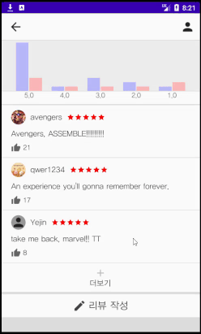
>
>리뷰가 있는 곳에서 더보기 버튼을 누르면 이 때도 데이터베이스와 통신을 하게 됩니다.  
>마찬가지로 사용자에게 통신 중임을 알려주고, 통신 후에는 리뷰들을 보여주면서  
>자동으로 화면이 스크롤됩니다.
>
>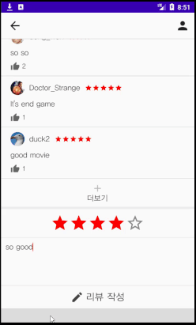
>
>리뷰를 작성한 후에는 본인이 작성한 리뷰가 있는 곳으로 자동 스크롤됩니다.  
>또한 본인이 쓴 리뷰는 항상 옅은 빨강 배경으로 강조됩니다.  
>  
>이처럼 여러 곳에서 사용자기 앱과 상호작용하기 쉽도록 기능을 제공하고 있습니다.

#### (3) 자동 로그인
>
>Movier 앱은 자동 로그인 기능을 지원합니다. 로그인을 한 후에는 해당 로그인 정보를  
>sharedPreference를 통해 로컬에 저장하고 로그아웃을 하지 않는다면 이 정보는 삭제되지 않습니다.  
>이후 앱을 실행할 때 저장된 정보로 데이터베이스와 통신하여 자동으로 로그인합니다.
>
>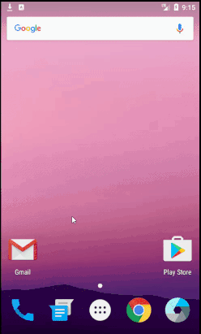
>
>데이터베이스와 통신하는 동안 progressDialog를 띄웁니다.  
>이후 navigationView를 통해 로그인이 되어 있는 것을 확인할 수 있습니다.

### 3. back-end 서버와의 통신

back-end 서버로는 Firebase를 사용했습니다.  
그 중에서 실시간 데이터베이스와 저장소 기능을 사용했습니다.

##### (1) 실시간 데이터베이스
>
>실시간 데이터베이스는 사용자 계정과 각 영화들의 리뷰들을 저장합니다.  
>사용자 계정에 대해서는 아이디를 key로 사용하여 아이디, 비밀번호, 성별을 저장합니다.
>
>
>
>사용자 계정에 대한 저장은 회원가입을 하는 Activity에서 가입 버튼을 눌렀을 때 데이터베이스에 계정을 저장합니다.  
>계정을 불러오는 작업은 로그인할 때, 혹은 앱을 실행하면서 자동 로그인 기능을 사용할 때 수행합니다.  
>이 외에 회원가입 시 아이디 중복 여부를 확인할 때 데이터베이스를 살펴봅니다.  
>
>영화 리뷰에 대해서는 영화 제목을 key로 그 안에 여러 사용자들의 리뷰가 저장됩니다.  
>각 리뷰는 작성한 계정의 아이디를 key로 아이디, 내용, 성별, 별점, 해당 리뷰의 좋아요를 누른 사람들이 저장됩니다.  
>
>
>
>영화 리뷰에 대한 저장은 리뷰 작성 버튼을 터치하여 리뷰를 작성한 후에,  
>리뷰가 있는 activity에서 나갈 때 onPause함수에 의해 직접 작성한 리뷰와 좋아요가 데이터베이스에 업데이트됩니다.  
>불러오는 작업은 메인 Acitivty에서 각 영화들의 평점을 계산할 때나  
>영화에 대한 자세한 정보가 있는 Activity에서 각 리뷰들을 불러오고, 그래프를 그리고, 평점을 계산할 때 수행합니다.  
>
##### (2) 저장소
>
>저장소는 오직 사용자들의 프로필 사진을 저장하기 위해서만 사용합니다.  
>저장한 프로필 사진은 로그인 시 불러와 navigationView에서 확인할 수 있고,  
>영화 리뷰를 작성한 사람들의 프로필 사진도 영화 검색 Activity에서 영화를 클릭해서 로딩할 때 가져옵니다.

### 4. 사용한 API
API는 NAVER의 검색 API를 사용했습니다. 검색 API를 통해 영화의 상세한 정보와 포스터를 가져오도록 했습니다.

### 5. 테스트 환경
안드로이드 스튜디오의 에뮬레이터를 사용하여 프로젝트의 최소 지원 기준인 API 24를 기반으로 한  
Nexus 5, Pixel 2 기종에 대한 테스트를 하였고 이 외에 프로젝트의 최대 기준인  
API 29가 설치된 Samsung Galaxy S10+에 대한 실제 스마트폰 테스트도 했습니다.