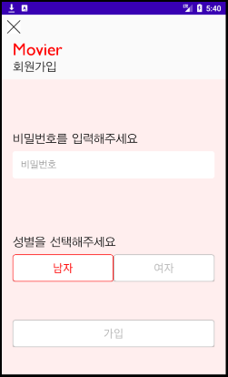
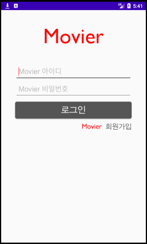
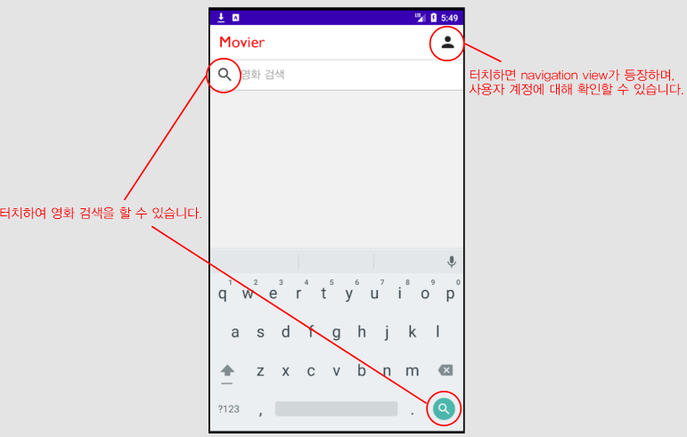
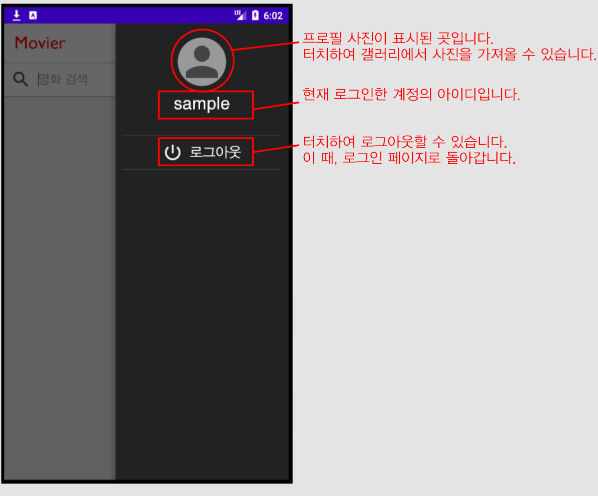
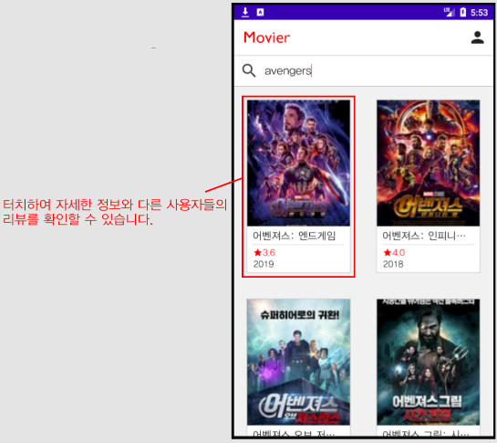
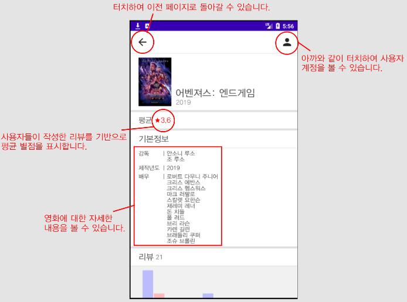
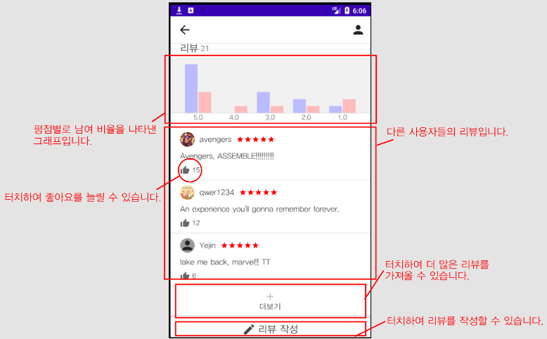
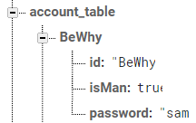
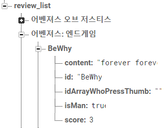

Movier
======

Movier은 앱 사용자 간에 영화에 대한 평가를 공유할 수 있는 앱입니다.

## 목차
1. 앱 개요
2. back-end 서버와의 통신
3. 사용한 API
4. 테스트 환경

### 1. 앱 개요

앱을 다운받고 최초로 실행하면 회원가입을 담당하는 Activity가 켜집니다.

 

아이디와 비밀번호를 입력해서 가입 버튼을 누르면 로그인 Activity로 넘어갑니다.

회원가입때 사용한 아이디와 비밀번호를 사용하여 로그인하면 메인 Activity로 넘어갈 수 있습니다.

'영화 검색'이라고 쓰여진 부분에 영화 제목을 작성하여 검색할 수 있습니다.  
이 외에 오른쪽 상단의 사람 모양 아이콘을 누르면 Navigation View를 통해 사용자 계정에 대해 확인할 수 있습니다.

사람 모양 아이콘을 터치하면 이렇게 오른쪽에서 navigation view가 나옵니다.

navigation view를 닫고, 영화 제목을 쓰고 검색 버튼을 터치하면 2열로 영화들이 나옵니다.  
터치하여 해당 영화에 대한 자세한 정보와 다른 사용자들의 리뷰가 있는 Activity로 넘어갈 수 있습니다.

영화에 대한 자세한 정보와 다른 사용자들의 리뷰를 이 Activity에서 확인할 수 있습니다.

여기서 평점 별로 남여 비율을 나타낸 그래프를 확인할 수 있고,  
다른 사람들의 리뷰도 확인할 수 있습니다.  
리뷰가 마음에 든다면 좋아요 버튼을 눌러줄 수도 있습니다.  
더보기 버튼을 터치하여 더 많은 사람들의 리뷰도 확인할 수 있습니다.  
아니면 리뷰 작성 버튼을 터치하여 직접 작성할 수도 있습니다.

### 2. back-end 서버와의 통신

back-end 서버로는 Firebase를 사용했습니다.  
그 중에서도 실시간 데이터베이스와, 저장소 기능을 사용했습니다.

>##### (1) 실시간 데이터베이스
>
>실시간 데이터베이스는 사용자 계정과 각 영화들의 리뷰들을 저장합니다.  
>사용자 계정에 대해서는 아이디를 key로 사용하여 아이디, 비밀번호, 성별을 저장합니다.
>
>
>
>사용자 계정에 대한 저장은 회원가입을 하는 Activity에서 가입 버튼을 눌렀을 때 데이터베이스에 계정을 저장합니다.  
>계정을 불러오는 작업은 앱을 실행했을 때 처음 1회 수행합니다.  
>이 외에 회원가입 시 아이디 중복 여부를 확인할 때 데이터베이스를 살펴봅니다.  
>
>영화 리뷰에 대해서는 영화 제목을 key로 그 안에 여러 사용자들의 리뷰가 저장됩니다.  
>각 리뷰는 작성한 계정의 아이디를 key로 아이디, 내용, 성별, 별점, 해당 리뷰의 좋아요를 누른 사람들이 저장됩니다.
>
>
>
>영화 리뷰에 대한 저장은 리뷰 작성 버튼을 터치하여 작성할 때에만 수행합니다.  
>불러오는 작업은 메인 Acitivty에서 각 영화들의 평점을 계산할 때나  
>영화에 대한 자세한 정보가 있는 Activity에서 각 리뷰들을 불러오고, 그래프를 그리고, 평점을 계산할 때 수행합니다.
>
>##### (2) 저장소
>
>저장소는 오직 사용자들의 프로필 사진을 저장하기 위해서만 사용합니다.  
>저장한 프로필 사진은 로그인 시 불러오며, Navigation view에서 보여주거나, 리뷰에 띄워줍니다.

### 3. 사용한 API
API는 Naver의 검색 API를 사용했습니다.

### 4. 테스트 환경
안드로이드 스튜디오의 에뮬레이터를 사용하여 프로젝트의 최소 지원 기준인 API 24를 기반으로 한 Nexus 5, Pixel 2 기종에 대한 테스트를 하였고  
이 외에 프로젝트의 최대 기준인 API 29가 설치된 Samsung Galaxy S10+에 대한 테스트도 했습니다.