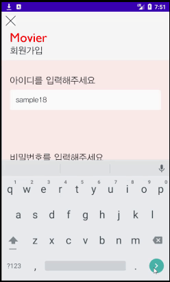

Movier
======

Movier은 앱 사용자 간에 영화에 대한 평가를 공유할 수 있는 앱입니다.

## 목차
1. 앱 개요
2. 앱 특징
3. back-end 서버와의 통신
4. 사용한 API
5. 테스트 환경

### 1. 앱 개요

앱을 다운받고 최초로 실행하면 회원가입을 담당하는 Activity가 켜집니다.

 

아이디와 비밀번호를 입력하고 성별을 선택한 뒤, 가입 버튼을 누르면 로그인 Activity로 넘어갑니다.

회원가입때 사용한 아이디와 비밀번호를 사용하여 로그인하면 메인 Activity로 넘어갈 수 있습니다.  
로그인한 계정 정보는 로컬에 저장되며, 이후 앱 실행 때 저장한 정보로 자동 로그인합니다.

'영화 검색'이라고 쓰여진 부분에 영화 제목을 작성하여 검색할 수 있습니다.  
이 외에 오른쪽 상단의 사람 모양 아이콘을 누르면 Navigation View를 통해 사용자 계정에 대해 확인할 수 있습니다.

사람 모양 아이콘을 터치하면 이렇게 오른쪽에서 navigation view가 나옵니다.

navigation view를 닫고, 영화 제목을 쓰고 검색 버튼을 터치하면 2열로 영화들이 나옵니다.  
터치하여 해당 영화에 대한 자세한 정보와 다른 사용자들의 리뷰가 있는 Activity로 넘어갈 수 있습니다.

영화에 대한 자세한 정보와 다른 사용자들의 리뷰를 이 Activity에서 확인할 수 있습니다.

여기서 평점 별로 남여 비율을 나타낸 그래프를 확인할 수 있고,  
다른 사람들의 리뷰도 확인할 수 있습니다.  
리뷰가 마음에 든다면 좋아요 버튼을 눌러줄 수도 있습니다.  
더보기 버튼을 터치하여 더 많은 사람들의 리뷰도 확인할 수 있습니다.  
아니면 리뷰 작성 버튼을 터치하여 직접 작성할 수도 있습니다.

### 2. 앱 특징

앱 특징으로는 다음과 같이 있습니다.
1. Landscape 지원
2. 사용자와의 상호작용

#### (1) Landscape 지원
>
>Movier 앱은 어느 화면에서나 가로 화면을 지원합니다.  
>
>  
>  
>  
>  
>
>세로 화면에서 가로 화면으로 앱 사용 도중 전환해도 정보 손실이 일어나지 않습니다.  
>또한, 영화를 검색하는 Activity에서는 가로 화면으로 전환하면서 넓어지는 가로 길이에 맞추어  
>영화가 나열되는 배치가 2열에서 3열로 바뀌도록 했습니다.  
>
>  

#### (2) 사용자와의 상호작용
>
>Movier 앱은 사용자와 상호작용할 때 즉각적이고 직관적인 피드백을 할 수 있도록 디자인되어 있습니다.  
>
>
>
>회원가입 페이지에서 처음에는 가입 버튼이 회색으로 되어 있는 것을 확인할 수 있습니다.  
>이는 가입을 하기 위해 조건이 충족되지 않았다는 뜻입니다.  
>이 때 버튼을 터치하면 어떤 조건이 필요한지 즉각적으로 피드백을 해줍니다.
>
>
>
>아이디와 비밀번호 입력칸이 비어있다고 사용자에게 알려줍니다.  
>이제 아이디를 입력해보겠습니다. 아이디 입력칸은 문자가 입력될 때마다 데이터베이스와 통신하여  
>중복된 아이디인지 검사합니다.
>
>
>
>이 피드백을 보고 사용자는 아이디가 중복되어서 다른 아이디를 사용해야 한다는 것을 바로 알 수 있습니다.  
>아이디를 입력하고 나서 비밀번호 입력칸이 선택되면 비밀번호 입력칸의 위치에 맞게 자동으로 스크롤됩니다.
>
>
>
>아이디와 비밀번호를 조건에 맞게 입력하고 나면 가입 버튼이 빨갛게 변한 것을 확인할 수 있습니다.
>이제 버튼을 터치하면 가입이 완료됩니다.
>
>
>
>

### 3. back-end 서버와의 통신
>

back-end 서버로는 Firebase를 사용했습니다.  
그 중에서 실시간 데이터베이스와 저장소 기능을 사용했습니다.

##### (1) 실시간 데이터베이스
>
>실시간 데이터베이스는 사용자 계정과 각 영화들의 리뷰들을 저장합니다.  
>사용자 계정에 대해서는 아이디를 key로 사용하여 아이디, 비밀번호, 성별을 저장합니다.
>
>
>
>사용자 계정에 대한 저장은 회원가입을 하는 Activity에서 가입 버튼을 눌렀을 때 데이터베이스에 계정을 저장합니다.  
>계정을 불러오는 작업은 로그인할 때, 혹은 앱을 실행하면서 자동 로그인 기능을 사용할 때 수행합니다.  
>이 외에 회원가입 시 아이디 중복 여부를 확인할 때 데이터베이스를 살펴봅니다.  
>
>영화 리뷰에 대해서는 영화 제목을 key로 그 안에 여러 사용자들의 리뷰가 저장됩니다.  
>각 리뷰는 작성한 계정의 아이디를 key로 아이디, 내용, 성별, 별점, 해당 리뷰의 좋아요를 누른 사람들이 저장됩니다.  
>
>
>
>영화 리뷰에 대한 저장은 리뷰 작성 버튼을 터치하여 리뷰를 작성한 후에,  
>리뷰가 있는 activity에서 나갈 때 onPause함수에 의해 직접 작성한 리뷰와 좋아요가 데이터베이스에 업데이트됩니다.  
>불러오는 작업은 메인 Acitivty에서 각 영화들의 평점을 계산할 때나  
>영화에 대한 자세한 정보가 있는 Activity에서 각 리뷰들을 불러오고, 그래프를 그리고, 평점을 계산할 때 수행합니다.  
>
##### (2) 저장소
>
>저장소는 오직 사용자들의 프로필 사진을 저장하기 위해서만 사용합니다.  
>저장한 프로필 사진은 로그인 시 불러오며, Navigation view에서 보여주거나, 리뷰에 띄워줍니다.

### 4. 사용한 API
API는 NAVER의 검색 API를 사용했습니다. 검색 API를 통해 영화의 상세한 정보와 포스터를 가져오도록 했습니다.

### 5. 테스트 환경
안드로이드 스튜디오의 에뮬레이터를 사용하여 프로젝트의 최소 지원 기준인 API 24를 기반으로 한  
Nexus 5, Pixel 2 기종에 대한 테스트를 하였고 이 외에 프로젝트의 최대 기준인  
API 29가 설치된 Samsung Galaxy S10+에 대한 실제 스마트폰 테스트도 했습니다.